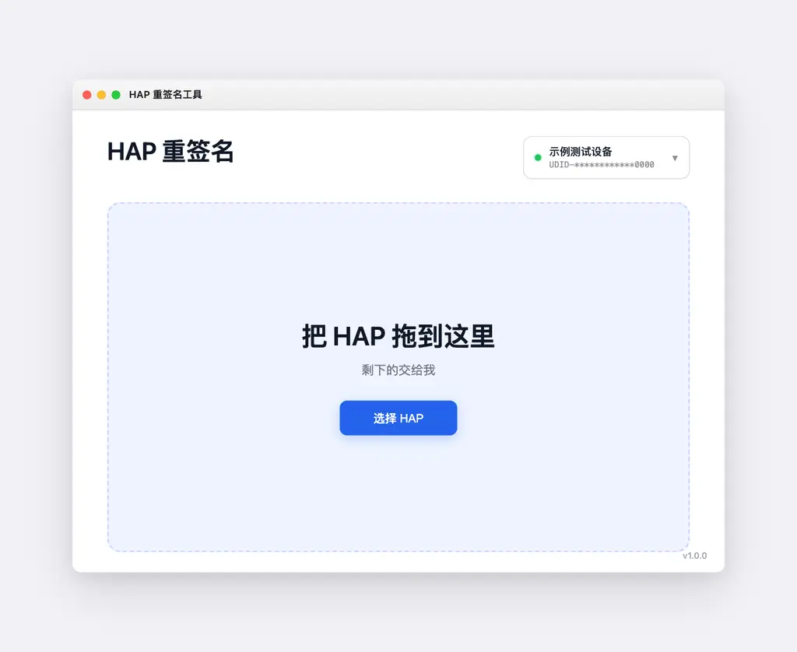

# HAP Resigner

<p align="center">
  <b>纯 Rust 实现的 HarmonyOS / OpenHarmony HAP 重签名与自动安装工具</b>
</p>

<p align="center">
  <a href="https://github.com/toads/hap-resigner/releases/latest"></a>
  
  
  
</p>

---

## 简介

**HAP Resigner** 是面向 HarmonyOS / OpenHarmony 开发者的跨平台桌面与命令行工具。拖入 HAP 文件，即可自动完成重签名并安装到连接设备。

<p align="center">
  
</p>

---

## 特性

- **纯 Rust 原生**：无 JVM、Python、WebView 依赖；macOS 包约 6 MB，Windows 包约 8.5 MB。
- **一键重签安装**：自动识别包名、匹配证书与 Profile、覆盖签名、安装并启动 Ability。
- **顶栏设备选择**：自动探测多设备，下拉切换并记忆目标，防止误装。
- **系统主题自适应**：自动跟随 macOS / Windows 明暗主题。
- **安全默认**：强制 TLS 校验；私钥密码与 OAuth Token 存入系统密钥库；错误信息脱敏。
- **合规签名**：支持 HAP v3 签名块、APK-v2 Chunked Digest、fs-verity Merkle Tree 与 native `.so` 代码签名。

---

## 下载

在 [Releases](https://github.com/toads/hap-resigner/releases/latest) 下载预编译包：

| 平台 | 制品包 | 说明 |
| :--- | :--- | :--- |
| **macOS** (Apple Silicon) | `HAP-Resigner-v1.0.0-macos-arm64.zip` | 解压后双击 `HAP Resigner.app` |
| **Windows** (x64) | `HAP-Resigner-v1.0.0-windows-x64.zip` | 解压后运行 `hap-resigner.exe` |

每个发布包均附带 `.sha256` 校验文件。

---

## 快速上手

### GUI

1. 启动应用，确认顶部设备选择器中的目标设备；
2. 将 `.hap` 拖入窗口（或点击「选择 HAP」）；
3. 首次缺少签名材料时按提示完成华为账号授权；
4. 等待签名、安装、启动完成。

### CLI

```bash
# 自检
hap-resigner-cli --selftest

# 命令行签名
hap-resigner-cli sign \
  --input entry-unsigned.hap \
  --output entry-signed.hap \
  --p12 debugKey.p12 \
  --certificate debug.cer \
  --profile profile.p7b \
  --password 123456
```

---

## 源码构建

要求：Rust 1.95+（Rust 2024 Edition）。

```bash
git clone https://github.com/toads/hap-resigner.git
cd hap-resigner

cargo test --locked --features app

# macOS
./build_mac.sh

# Windows
cargo build --locked --release --features app
```

---

## 架构

```
src/
├── hap/        # HAP v3 签名、fs-verity、CMS/PKCS#7
├── agc/        # AGC 客户端、严格 TLS、错误脱敏
├── materials/  # 本地密钥与 Profile 管理
├── device/     # 内嵌 HDC Host 与设备枚举
└── app/        # egui GUI 与工作流
```

---

## 许可证

[MIT](LICENSE-MIT) 或 [Apache-2.0](LICENSE-APACHE)。
